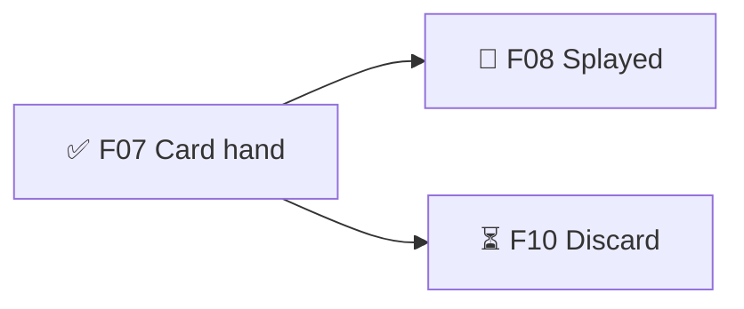

# BMUZ project files — the shared rules every command follows

## Layout
```
version.json        X.Y.Z + build (~/.claude/references/versioning.md)
content/            data the game reads; Muzzy edits it in Obsidian or the Dev Kit (tuning/, anim/, text/, data/, ui/ = style.json + settings.json from game-ui, credits.json)
.planning/
  GDD.md            the design: what it is, how it plays, how it should feel, scope   (/discover /define · /gdd)
  TDD.md            the engineering plan: how it's built, standards, decisions, compliance   (/define · /tdd)
  ROADMAP.md        milestones → features with dependencies, plus Later and Ideas   (/define · /roadmap)
  SPRINT.md         the current sprint's features and tasks   (/sprint · /develop)
  BUGS.md           the bug list, P0–P3   (/bug)
  STATE.md          ▶ RESUME HERE, key facts, short log   (every command; /save rewrites it)
  design/ research/ bugs/   optional: long design specs linked from the GDD · discovery + sims · bug captures
  archive/          finished sprints, old logs, old GSD files — search it when something feels familiar
```
Nothing else goes in `.planning/` — no summaries, no side docs. Investigations go to archive once their rules are in Key facts.
New project or old GSD project → `~/.claude/config/bmuz/SETUP-AND-CONVERT.md`.

## Planning model
```
RELEASE     prototype → alpha → beta → 1.0     done = all its musts done
 MILESTONE  v0.3 — Card play feels good        (ROADMAP)
  FEATURE   F07 🧱 Card hand system             (ROADMAP — has needs:)
   TASK     🤖 2. Lay out cards in an arc — Hand.tsx   (SPRINT)
```
- **Types:** ❓ decision (often Muzzy's) · 🧱 foundation others stand on · 🎮 player-facing · ✨ polish · 🔧 Dev Kit tool · 🐞 a bug big enough to need its own feature (normal bugs live in BUGS.md; an affected feature notes `LIVE BROKEN → B003`).
- **States** (only in ROADMAP): ⏳ waiting → 🟢 ready → 🔨 building → 🎛️ tuning (works, being dialled in) → ✅ done.
- **Ready rule:** all `needs:` are ✅ — or 🎛️ for `~` needs (only has to work).
- **Sprint rule:** a sprint may also take a feature whose needs are earlier *in the same sprint*, lined up after them.
- **❓ decisions:** 1–2 tasks; ✅ only when Muzzy answers (Claude may recommend). If he's right there, just ask.
- **Scope:** `must:<stage>` · `should` · `could` (won't-haves stay in the GDD). "Musts X/Y" counts non-❓ features.
- **Owners:** 🤖 Claude · 🙋 Muzzy (art, decisions, feel checks on a device). Stand-in art is a task `(stand-in)`; handed-over tasks switch owner with a note.

## ROADMAP.md
```markdown
# <Name> — Roadmap
Release target: alpha — musts 7/9 done
## v0.2 — Playable prototype  ✅ released (prototype) 2026-10-02
## v0.3 — Card play feels good  ← current  (→ alpha)
Goal: <what a player can do when this is done>
- ✅ F07 🧱 Card hand system — must:alpha
- 🔨 F08 🎮 Splayed cards — must:alpha · needs: F07 · sprint 4
  what: <optional one-line goal>
  why: fan layout → players scan the whole hand → Mastery   ← optional MDA trace (🎮 ✨ ❓)
- ⏳ F10 🎮 Discard pile — must:alpha · needs: F09, F07

## Later
- <unscheduled features, scope if known> · Watch: B00x <patched bug that might return>
## Ideas
- 2026-10-05 — <raw idea; anyone appends; /roadmap turns good ones into features>
```
IDs are permanent. Each milestone ends with a small Mermaid graph (solid = needs, dotted = `~`) kept in sync. Milestone names needn't match version.json.

## SPRINT.md  (1–4 features, one goal; ends when they're done)
```markdown
# Sprint 04 — <what we'll see/play at the end>
Started <date> · Milestone v0.3 · Features: F08, F11 (in this order)
## F08 🎮 Splayed cards
Done when: <what Muzzy sees/plays>
- [x] 🤖 1. Arc layout math — src/hand/layout.ts
- [ ] 🙋 2. Stand-in card fronts (stand-in)
- [ ] 🤖 3. Tune spread + overlap (tuning)
Check: <test / visual check / "Muzzy fans 7 cards on phone">
Ask Muzzy: <open questions>   Notes: <decisions, surprises, Tuning: knob old→new — why — result>
```
3–8 tasks per feature (❓: 1–2); tasks name real files. Numbered from 01. Finished → `archive/sprints/sprint-NN.md`, commit `Sprint NN done`.

## BUGS.md
```markdown
# <Name> — Bugs
Open: 5 (P0 0 · P1 1 · P2 3 · P3 1)
## Open
### B014 · P1 · open · found <date> in F08 · v0.2.0.93 · Pixel 6
<title>
Steps: 1… 2… · Expected: … · Actual: … · How often: …
## Fixed (newest first)
### B009 · P2 · verified <date> · fixed in a1b2c3d · Guarded by: tests/score.test.ts
```
P0 crash/can't continue/live broken (fix now, blocks /deliver) · P1 feature broken · P2 minor · P3 cosmetic.
Statuses: open → fixing → fixed → verified (Muzzy confirmed; required for P0/P1) · watching · can't reproduce · won't fix. Old fixed entries → `archive/bugs.md` after each release.

## content/credits.json  (every asset we didn't make ourselves)
```json
[
  { "paths": ["public/icons/sword.svg", "public/icons/potion.svg"], "source": "game-icons.net",
    "author": "Lorc", "licence": "CC-BY 3.0", "light": "🟡", "url": "https://game-icons.net",
    "credit": "Icons made by Lorc. Available on https://game-icons.net" },
  { "paths": ["public/models/kenney-dice/"], "source": "Kenney", "author": "Kenney",
    "licence": "CC0", "light": "🟢", "url": "https://kenney.nl/assets/...", "credit": "" }
]
```
Light and credit lines come from `~/.claude/references/indie-toolkit.md`. 🟡 → the `credit` line must show in the game's Credits screen. 🔴 → never ships (/deliver checks). organize-assets keeps it up to date.

## STATE.md  (under ~120 lines)
```markdown
## ▶ RESUME HERE
<2–5 lines: where things stand, the exact next action, `Muzzy: …` lines for his to-dos. Always REPLACE, never append.>
## Where we are
Stage · Milestone · Sprint · Doing · Branch · Version · Live (url + release stage)
## Key facts
<~40 lines max, under bold labels (Run/deploy, Rules, Architecture, Don't re-break). Prune stale ones.>
## Log
<newest first, one line per /save; keep 10, older → archive/log.md>
```
