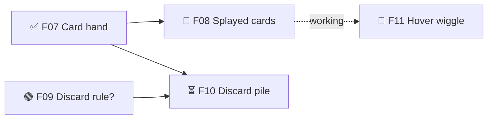

# BMUZ project files — the shared rules every verb follows

Installed at `~/.claude/config/bmuz/PROJECT-FILES.md`. Every BMUZ verb reads this.

## The layout
```
version.json          — X.Y.Z + build (see ~/.claude/references/versioning.md)
.planning/
  GDD.md              — Game Design Document: what the game is, how it plays, scope. /discover + /define write it, /gdd shows it.
  TDD.md              — Technical Design Document: how it's built, standards, decisions, compliance. /define writes it, /tdd shows it.
  BUGS.md             — the bug list (P0–P3). /bug writes it.
  bugs/               — Dev Kit bug-capture files and screenshots (optional)
  ROADMAP.md          — big picture: milestones → features, with dependencies. /define creates, /roadmap views + edits.
  SPRINT.md           — small picture: the current sprint's features and tasks. /sprint creates + views, /develop works it.
  STATE.md            — ▶ RESUME HERE + key facts + short log. Every verb keeps it current; /save is the full rewrite.
  VISION.md           — parking lot for ideas not being built now. Anyone appends.
  design/             — long-lived design specs the GDD links to: tutorial scripts, glossary,
                        balance philosophy, feel/physics targets (optional)
  research/           — discovery research, sim results (optional)
  archive/            — finished sprints, old log entries, old GSD files. Not read routinely —
                        but search it when a bug or question feels familiar ("did we fix this before?").
content/              — data the game reads and Muzzy edits (Obsidian or the Dev Kit): tuning/, anim/, text/, data/
docs/                 — generated reference docs from specialist skills (style guide, architecture map,
                        asset catalog…). Optional; link the important ones from the GDD.
```
Nothing else goes in `.planning/`. No SUMMARY files, no work-note side docs. Every file in `design/` must be linked from a GDD section; investigations and fix-plans go to archive once their rules are copied into Key facts.

## The planning model
```
RELEASE     prototype → alpha → beta → 1.0          (what "done" means: all its musts are done)
 MILESTONE  v0.3 — Card play feels good             (a player-visible goal; ROADMAP)
  FEATURE   F07 🧱 Card hand system                 (one buildable thing with dependencies; ROADMAP)
   TASK     🤖 2. Lay out cards in an arc — Hand.tsx (a concrete step; SPRINT)
```
**Feature types**
- ❓ **decision** — a design question to settle before something can be built (often Muzzy's)
- 🧱 **foundation** — a building block other features stand on (card hand before splayed cards)
- 🎮 **player-facing** — something the player sees and uses
- ✨ **polish** — juice, feel, presentation
- 🔧 **tool** — a Dev Kit tool (see `~/.claude/config/bmuz/DEVKIT.md`) — gets real time, built well, then shared across games
- 🐞 **bug** — only for a bug big enough to need its own multi-task feature; all bugs are tracked in BUGS.md (a feature affected by a bug keeps its real type and notes `LIVE BROKEN → B003`)

**Feature states** (ROADMAP is the only place states live — SPRINT.md just ticks tasks):
`waiting` (needs aren't met) → `ready` → `building` → `tuning` (works; feel/numbers being dialled in — optional) → `done`

**Ready rule:** a feature is `ready` when every feature in its `needs:` is `done` — or `tuning`, for needs marked `~` (it only has to *work*, e.g. `needs: ~F07`).
**Sprint rule:** a sprint may take a feature whose needs are met *or are earlier in the same sprint* — F03 (needs F01) can share a sprint with F01 as long as F01's tasks come first. That keeps dependency chains from costing a sprint per link, while still never building something before what it stands on.

**❓ decisions** are small: 1–2 tasks (Muzzy picks → Claude writes the answer into the GDD section it affects). ✅ only when Muzzy answers (Claude may recommend — e.g. via /tdd — but the ❓ stays open until he says OK). If Muzzy is right there (e.g. during /define), just ask — don't park it for a sprint.

**Scope** (set in the GDD, copied onto each feature): `must:<stage>` (must-have for that release stage — `must:alpha`, `must:beta`, `must:1.0`…), `should`, `could`. Won't-haves stay in the GDD only. A release is done when **every `must:` feature for it is done**.

**Owners on tasks:** 🤖 Claude · 🙋 Muzzy (art, decisions, checking feel on a real device). Stand-in art is a task too: `🙋 stand-in card backs (stand-in)`; final art later gets its own task marked `(final)`. If Muzzy hands a task over ("you do the stand-ins"), change 🙋 to 🤖 and note it.

## ROADMAP.md format
```markdown
# <Name> — Roadmap
Release target: alpha — musts 7/9 done   (or `Release target: not set` until Muzzy picks one)

## v0.2 — Playable prototype  ✅ released (prototype) 2026-10-02
## v0.3 — Card play feels good  ← current  (→ alpha)
Goal: <one line: what a player can do when this milestone is done>
- ✅ F07 🧱 Card hand system — must:alpha
- 🔨 F08 🎮 Splayed cards — must:alpha · needs: F07 · sprint 4
  what: cards fan out in an arc; hovering lifts one   ← optional one-line goal
  why: fan layout → players scan the whole hand at once → Mastery ("I can plan my turn")   ← optional MDA trace (🎮 ✨ ❓ only)
- 🟢 F09 ❓ Decide discard rule — must:alpha · 🙋
- ⏳ F10 🎮 Discard pile — must:alpha · needs: F09, F07
- 🔨 F11 ✨ Card hover wiggle — could · needs: ~F08 · sprint 4 (after F08)



## v0.4 — <name>  (→ alpha)
Goal: ...
- ⏳ F12 ... — needs: F10

## Later
- <unscheduled features or milestones — one line each, with scope if known>
- Watch: <known bug that's patched but might return — pointer to details>
```
State marks: ⏳ waiting · 🟢 ready · 🔨 building · 🎛️ tuning · ✅ done.
"Musts X/Y" counts only non-❓ features in ROADMAP (decisions don't count); for converted projects add `(+N milestones shipped before conversion)`. Shipped milestones with no known release stage: `✅ shipped <date>`.
Later items that get picked up become real features first (next ID, type, scope, needs).
Each milestone section ends with a small Mermaid graph of its features (solid arrow = needs, dotted = `~` needs) so Obsidian draws the dependencies. Keep it in sync when features or needs change.
Feature IDs (`F07`) are permanent and never reused; new features take the next number wherever they land. Milestone names are whatever the project uses (v0.3, v1.6…) — they don't have to match version.json.

## SPRINT.md format (a sprint = 1–4 ready features with one goal; it ends when they're done)
```markdown
# Sprint 4 — <goal: what we'll be able to see/play at the end>
Started 2026-10-05 · Milestone v0.3 · Features: F08, F11 (in this order)

## F08 🎮 Splayed cards
Done when: <what Muzzy sees/plays, 1–2 lines>
- [x] 🤖 1. Arc layout math — src/hand/layout.ts
- [ ] 🤖 2. Hover lifts card — Card.tsx
- [ ] 🙋 3. Stand-in card fronts (stand-in)
- [ ] 🤖 4. Tune spread angle + overlap (tuning)
Check: <test / visual check / "Muzzy fans 7 cards on phone, none overlap the edge">
Ask Muzzy: <open questions, one line each>
Notes: <decisions made while building, surprises>

## F11 ✨ Card hover wiggle   (needs ~F08 — starts once F08 works)
...
```
3–8 tasks per feature (❓ decisions: 1–2); more means it's two features. Tasks name real files. Features run in the listed order; independent ones can run in parallel if they don't touch the same files. Sprint files are committed on whatever branch is current.
Sprints are numbered from 1 per project (two digits in file names/commits: `sprint-01.md`, `Sprint 01: …`).
When a sprint ends: move SPRINT.md to `.planning/archive/sprints/sprint-NN.md` (commit `Sprint NN done`).

## BUGS.md format
```markdown
# <Name> — Bugs
Open: 5 (P0 0 · P1 1 · P2 3 · P3 1)

## Open
### B014 · P1 · open · found 2026-10-05 in F08 · v0.2.0.93 · Pixel 6
Dice keep pulsing after unlock
Steps: 1. Roll 2. Drag a die to unlock 3. Let the timer end
Expected: pulses once · Actual: pulses forever · How often: every time
Evidence: bugs/B014-capture.json

## Fixed (newest first)
### B009 · P2 · verified 2026-10-03 · fixed in a1b2c3d · Guarded by: tests/score.test.ts
Score shows 11 when it should be 12 — cause: off-by-one in bonus loop
```
P0 crash/can't continue/live broken (fix now, blocks /deliver) · P1 feature broken (this sprint) · P2 minor/workaround (queue) · P3 cosmetic.
Statuses: open → fixing → fixed (test passes) → verified (Muzzy confirmed; required for P0/P1) · `watching` (patched, might return) · `can't reproduce` / `won't fix` (with why). ROADMAP `Watch:` lines just point to B-numbers.
Fixed entries older than the last release move to `.planning/archive/bugs.md`.

## STATE.md template (keep under ~120 lines)
```markdown
# <Name> — State

## ▶ RESUME HERE
<2–5 lines: where things stand, the exact next action, anything Muzzy must do by hand (as `Muzzy: …` lines).
Always REPLACE this section, never append to it.>

## Where we are
Stage: <discover | define | develop | deliver>   Milestone: <v0.3 — name>   Sprint: <4 — goal, or "none">
Doing: <F08 — building, or "between sprints">
Branch: <branch — if not main, one line on what it holds and whether main is behind>   Version: <X.Y.Z.B>
Live: <url + release stage, or "not released">

## Key facts
<Things that must survive between sessions, grouped under short bold labels (Run/deploy, Rules,
Architecture, Don't re-break…): how to run and release it, dev server ports, env quirks, architecture
rules, decisions that shouldn't be re-argued, and bug fixes that must not be undone. ~40 lines max.
Prune stale ones. Detail that only matters to one subsystem belongs in the GDD or design/.>

## Log
<Newest first. One entry per /save: "- YYYY-MM-DD — what changed (1–3 lines)".
Keep the 10 newest; move older entries to .planning/archive/log.md.>
```

## Setting up a project (any verb does this if it's missing)
If the folder has no `.planning/STATE.md`:
1. Ask the game's name (or use the folder name if obvious).
2. `git init` if not a repo. Ensure `.gitignore` has `node_modules/`, `dist/`, `.env`, `.playwright-mcp/`, `.claude/settings.local.json`, `.planning/STATE.md.bak`. Add `.gitattributes` with `* text=auto eol=lf`.
3. Create `version.json`: `{"name": "<Name>", "version": "0.0.0", "build": 0, "history": [{"version": "0.0.0", "date": "<today>", "summary": "Project created"}]}`
4. Create `.planning/STATE.md` from the template (Stage: discover, RESUME HERE: "New project — next: /discover, or /define if you already know what you want") and `.planning/VISION.md` (`# Vision — ideas for later`).
5. Commit `Set up <Name> with BMUZ`. No tag (tags come from /deliver). Note the default branch name (main or master) in Key facts.
6. No git remote? Ask once: "Want me to make a private GitHub repo so it's backed up and synced to the laptop?" Yes → `gh repo create TheBlueMuzzy/<folder> --private --source . --push` (for a web game that'll live on GitHub Pages, mention free Pages needs the repo public — ask which). No → write `Remote: none (declined <date>)` in Key facts and never ask again unless Muzzy brings it up.
Say what you did in two lines. Don't lecture.

## Old GSD layout — what every verb does before conversion
Signs: `.planning/PROJECT.md` or `phases/`, or STATE says "Phase: X of Y".
- `/save`, `/play`, `/deliver`: don't restructure anything. Add a dated line to the old STATE's status section, do the job, and say "This project still uses the old layout — `/roadmap` or `/sprint` will convert it."
- `/roadmap`, `/sprint`, `/develop`, `/define`: offer the conversion below first.

## Converting an old GSD project (do once, when first touched)

1. Look first: scan `.claude/settings.json` for BMUZ 1 hooks (and note any that are broken — e.g. running a script that doesn't exist). Then tell Muzzy: "This project uses the old GSD layout. I'll convert it to BMUZ-2 — nothing is deleted, old files go to `.planning/archive/gsd/`. I'll also remove these old hooks: …" Wait for OK (one OK covers converting and continuing with the verb).
2. **Archive first, in its own commit** (so git keeps file history): `git mv` STATE.md, ROADMAP.md, PROJECT.md, ISSUES.md, MILESTONES.md, config.json, phases/, milestones/, codebase/ into `.planning/archive/gsd/`. Old phase folders already in an existing `archive/` → `archive/gsd/phases/` too. Plain `mv` for untracked files (`*.bak`). Commit `Archive GSD planning files`. Build the new files *from the archived copies*.
   **Sort every other side doc** in `.planning/`:
   (a) living design content (specs, tutorial scripts, glossary, vision/philosophy) → `.planning/design/`, linked from the relevant GDD section;
   (b) bug investigations, fix-plans, post-mortems → archive, after collecting every "root cause / must not / rule" line (written into Key facts → Don't re-break in step 6) — **including ISSUES.md (fixed bugs too)** and the decisions of every SUMMARY in the current milestone;
   (c) workflow docs (SOP, HOME, nav hubs), duplicates, empty files → archive.
   Sorting side docs is moves only — same commit as the archive. Also `git mv .planning/PRD.md .planning/GDD.md` (it's the game design doc) and fix links to it.
3. **Trust the freshest source.** version.json, the code and `git log` beat old docs. Check before carrying anything over (e.g. an "open" issue a later milestone fixed). No version.json? Don't create one — write where the version lives in Key facts → Run/deploy.
   **Is the live build broken?** Check what deploys from the current branch. If the last phase left something half-wired on a live build, log it as a P0 in BUGS.md, mark the feature `LIVE BROKEN → B00x`, and say so first in RESUME HERE.
4. **ROADMAP.md:** shipped milestones → one heading line each with ✅ and date (keep their names). Current milestone → **one feature per old phase**, ID = `F` + phase number (`F47`; decimal 37.1 → `F37b`), typed and scoped as best you can, done ones ✅. **Releases:** if the GDD names none, ask once: "What stage is the live game at, and what's the next release you're aiming for?" (e.g. live = beta, next = 1.0). Record the live stage on the Live line and the next one as `Release target:`. Until answered write `Release target: not set` and scope features `must:next`. **Dependencies:** use each phase's `Depends on:` line; read the goals only if it's missing (if unclear, it needs the previous phase). Polish/UAT phases get `~` needs. A phase goal with an open question ("or…", "needs design", "TBD") also gets a ❓ decision feature (`F47a`) that the phase `needs:`. Future milestones and deferred phases → Later. Still-open issues (verified) → BUGS.md (step 6b); half-fixed ones → BUGS.md status `watching` + a ROADMAP `Watch: B00x` line.
5. **A phase that was mid-build or mid-testing** → start `SPRINT.md` with that feature: copy its unfinished GSD plan's remaining tasks (with owners) and test checklist; open blockers from its ISSUES file go into Notes / Ask Muzzy.
6. **STATE.md:** RESUME HERE from the old Current Status/Position (checked against git). Stage = develop (or deliver if it was mid-release). Where we are: note the branch if it isn't the default branch (main/master) — don't merge or rename it. Key facts from Deploy Process, Dev Server, Key Architecture, still-relevant Decisions, the current milestone's SUMMARY key-decisions, and every don't-re-break rule from 2(b); keep what a future Claude would most likely break or re-argue. Log = one line per git day of work (`git log --date=short`), using old Recent Changes text where it matches — git dates win; the 10 newest in STATE, the rest in `.planning/archive/log.md`.
6b. **TDD.md:** create it from the template (`~/.claude/config/bmuz/templates/TDD.md`), filled from old Key Architecture, **every clearly technical GDD section** (technical architecture, netcode flow, state shape — move them, leave pointers), a real look at the code (docs are often wrong about versions and numbers — the code wins), PROJECT.md key decisions (→ Decisions log, marked `(from GSD)`), and a quick look at the code. Compliance items unticked unless proven. Old ISSUES.md open bugs → BUGS.md with new B-numbers (keep the old ID in the title).
7. **GDD + VISION:** add anything PROJECT.md has that the GDD lacks (core value, constraints, out-of-scope, key decisions still in force). Add a Scope section if missing **before sorting ideas** — the Scope table from `define/stages/define.md`, placed after Design Principles, drafted from the roadmap; add `Muzzy: confirm draft scope + release target` to RESUME HERE. PROJECT.md vs GDD conflict → keep the GDD text, add a `Muzzy:` line. Ignore PROJECT items that later milestones shipped. Don't rewrite design sections that contradict shipped work — put one line in Key facts: `GDD out of date: §…` (/sprint adds an "update GDD §X" task when a sprint touches that area). **Move** (not copy) GDD future-idea sections to VISION.md keeping their numbers, leave a pointer in the GDD, and remove any "master list is in the GDD" line; ideas already sorted as should/could also get a one-liner in ROADMAP Later.
8. **Remote:** no git remote → write `Remote: none (noted at conversion <date>)` in Key facts so /save doesn't nag.
8b. **Old hooks and settings:** list the BMUZ 1 hooks in `.claude/settings.json` (SessionStart banner, Stop "STATE.md not updated", PostToolUse tests, PreCompact, PreToolUse main-block) in the step 1 OK message, then remove just those (keep any project-specific hook). If it's then `{}`, delete it (and `.claude/` if empty). If the edit is blocked by permissions, give Muzzy the exact command and add a `Muzzy:` line to RESUME HERE. If `.claude/settings.local.json` is tracked, `git rm --cached` it and add it to `.gitignore`. Add `.gitattributes` with `* text=auto eol=lf` if missing.
9. **Project CLAUDE.md:** remove BMUZ 1 rules (update STATE.md after every change, "Phase X, Plan Y, Task Z", /gsd:… tables, lossless pipeline, Stop-hook handoff blocks), project commands the verbs replace (`<save>`, `<flow>`, `<deploy>` — leave one line: "`<save>` → use `/save`"), "Current Status" blocks, and file-table rows pointing at archived files. Keep everything project-specific.
10. Commit `Convert planning to BMUZ-2`, then continue with the verb that triggered it.
