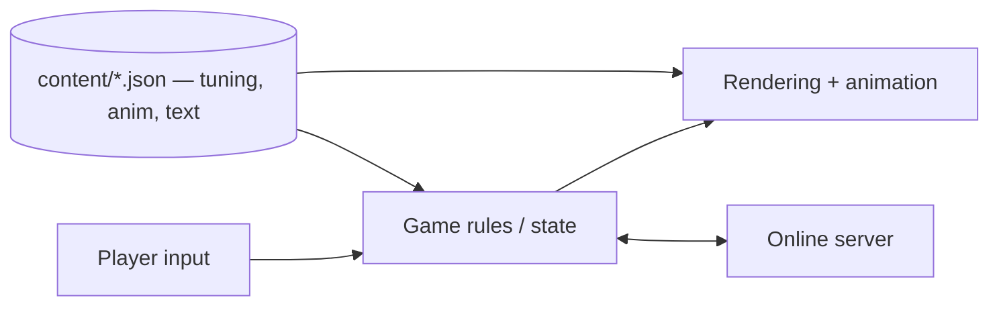

# <Name> — Technical Design Document (TDD)

> How the game is built. Plain English first; code names in `backticks` only where they help.
> Living document — /define writes it, /develop keeps it true, /tdd shows it.
> Last updated: <date>

## 1. At a glance
- **Platforms:** <web (desktop + phone browsers) / Android / iOS / Steam>
- **Stack:** <Vite + TypeScript + React + R3F / vanilla TS + DOM / Unity C#> — why: <1 line>
- **Where it runs online:** <GitHub Pages / Vercel / PartyKit server / none>
- **Dev Kit tools used:** <Tuning, Time, Snapshots, Bug capture, Perf, Animation…> (catalog: `~/.claude/config/bmuz/DEVKIT.md`) — **recommended next:** <tools this game would benefit from, and why>

## 2. How it fits together

<3–8 bullets, one per system: what it owns, which files/folders, who talks to it.>
**Golden rules** (the few architecture rules that must never be broken):
- <e.g. rules code never touches the screen; the screen only reads state>
- <e.g. every tweakable value lives in content/, never hardcoded>

## 2b. Game-specific systems (include the ones this game has)
**Multiplayer** — who's in charge of what (client or server) · message list (name → sent by → what it does) · reconnect and seat rules · what each deploy contains (front end vs server).
**Physics / simulation** — the feel numbers (gravity, bounce, damping…) live in `content/tuning/`; how "settled" is detected; how results are read.
**Timers** — every timer in one table, so two timers never fight:
| Timer | Length | Owned by (client/server) | Starts when | On expiry |
|---|---|---|---|---|

## 3. Data the game reads (editable by Muzzy — in Obsidian or the Dev Kit)
| File | What's in it | Edited with |
|---|---|---|
| `content/tuning/*.json` | speeds, timings, odds, costs | Dev Kit → Tuning |
| `content/anim/*.json` | named animation presets (`card.play`, `dice.pulse`) | Dev Kit → Animation |
| `content/text/en.json` | every player-facing word | Obsidian / Dev Kit → Text |
| `content/data/*.json` | cards, levels, units | Dev Kit → Content tables |

## 4. Standards (so any engineer could pick this up)
- **Folders:** <layout — one line per top folder>
- **Naming:** <files, components, JSON keys>
- **Readable code:** plain names, small files, a one-line comment on anything non-obvious. No clever tricks.
- **Tests:** rules and logic get tests (`npm run test`); every fixed bug gets a test that guards it. Feel is judged by Muzzy, not tests.
- **Testable by design:** game rules live in small pure functions (no screen, no network) so they can be tested; big glue files stay thin.
- **Same build everywhere:** the deploy (CI) runs the same `npm run build` as local, type check included — otherwise breakage hides until later.
- **Branches:** one work branch per delivery (`dev/<milestone>`), merged by /deliver.

## 5. Budgets
| | Target | How it's checked |
|---|---|---|
| Frame rate | 60 fps on a mid-range phone | Dev Kit → Perf |
| First load | < 3 s on 4G; download < <N> MB | /deliver quick check |
| Memory | no growth over a 10-minute session | Dev Kit → Perf |
| Network (online games) | messages per turn; free-tier limits of the server host | server logs |

## 6. Security & fairness
- <What a cheater could fake (e.g. client-reported dice) — and whether we care yet>
- Secrets: API keys never in the repo or the built game; `.env` is gitignored.

## 7. Compliance & legal (general audience — not made for kids)
- [ ] Privacy policy page (required by both app stores, even with no data collection)
- [ ] App store age rating questionnaire done honestly; do **not** tick "under 13" as a target age
- [ ] Google Play Data Safety form / Apple privacy labels match what the game really collects
- [ ] Any analytics, ads or accounts → consent + privacy policy updated (EU/UK GDPR)
- [ ] Every font, sound, image and code library is licensed for commercial use (list in §9)
- [ ] Accessibility basics: readable text sizes, color not the only signal, reduced-motion respected

## 8. Decisions log
Newest first. Every real "how should we build this" choice — including Muzzy's ideas.
```
D07 · 2026-10-12 · Cards drawn from one sprite sheet instead of separate images
  Proposed by: Muzzy   Options: separate PNGs / one sheet / SVG
  Chose: one sheet — Muzzy's idea; fewer downloads, one place to repaint
```

## 9. Third-party stuff
| What | Used for | License | OK for commercial? |
|---|---|---|---|

## 10. Risks & open questions
- <tech unknowns that could sink a milestone — and the spike that answers each>
